# API de Gerenciamento de Reservas de Salas

> Projeto prático desenvolvido durante a formação na Alura — API REST para gerenciamento de reservas de salas de reunião, construída com Java e Spring Boot.

---

## Índice

- [Sobre o Projeto](#sobre-o-projeto)
- [Evolução do Projeto](#evolução-do-projeto)
- [Fase 1 — Monolito](#fase-1--monolito)
- [Fase 2 — Microsserviços](#fase-2--microsserviços)
- [Como Executar](#como-executar)

---

## Sobre o Projeto

Esta API permite o gerenciamento completo de salas de reunião e suas reservas. O sistema controla a disponibilidade das salas, evita conflitos de horário entre reservas e mantém histórico de cancelamentos.

O projeto foi desenvolvido em duas fases: começou como um monolito REST e evoluiu para uma arquitetura de microsserviços com segurança, mensageria, testes de integração e documentação OpenAPI.

---

## Evolução do Projeto

| Etapa | Fase | O que foi implementado |
|-------|------|----------------------|
| **Etapa 1** | Monolito | CRUD completo de salas, usuários e reservas, regras de negócio, testes unitários |
| **Etapa 2** | Microsserviços | Spring Security — autenticação HTTP Basic, roles ADMIN/USER, respostas 401/403 |
| **Etapa 3** | Microsserviços | 2FA TOTP — autenticação em dois fatores com Google Authenticator |
| **Etapa 4** | Microsserviços | Mensageria — RabbitMQ (notificação) + Kafka (analytics) ao criar reserva |
| **Etapa 5** | Microsserviços | Testes de integração com Testcontainers (MySQL, RabbitMQ, Kafka reais) |
| **Etapa 6** | Microsserviços | OpenAPI/Swagger UI nos 3 serviços + pipeline CI com GitHub Actions |

---

# Fase 1 — Monolito

O projeto começou como uma **API REST monolítica**, com todos os recursos em um único serviço Spring Boot conectado a um único banco de dados MySQL.

## Tecnologias (Fase 1)

- Java 17
- Spring Boot 3.2
- Spring Data JPA
- Spring Web (REST)
- MySQL 8.0
- H2 (testes)
- Maven
- Lombok

## Estrutura (Fase 1)

```
src/main/java/
├── controller/
│   ├── ControllerSala.java
│   ├── ControllerUsuario.java
│   └── ControllerReserva.java
├── service/
│   ├── SalaService.java
│   ├── UsuarioService.java
│   └── ReservaService.java
├── repository/
│   ├── SalaRepository.java
│   ├── UsuarioRepository.java
│   └── ReservaRepository.java
├── model/
│   ├── Sala.java
│   ├── Usuario.java
│   ├── Reserva.java
│   └── StatusReserva.java     ← enum: ATIVA | CANCELADA
├── dto/
│   ├── SalaDTO.java
│   ├── UsuarioDTO.java
│   └── ReservaDTO.java
└── exception/
    ├── ApiExceptionHandler.java
    └── RegraDeNegocioException.java
```

## Diagrama de Entidade-Relacionamento


| Entidade | Campos principais |
|----------|-------------------|
| `SALA` | `id` (PK), `nome` (String, único), `capacidade` (int), `ativa` (boolean) |
| `USUARIO` | `id` (PK), `nome` (String), `email` (String, único) |
| `RESERVA` | `id` (PK), `salaId` (FK), `usuarioId` (FK), `inicio` (LocalDateTime), `fim` (LocalDateTime), `status` (StatusReserva) |

## Diagrama de Fluxo


## Operações possíveis


## Requisitos Funcionais (Fase 1)

### RF-01 — Gerenciamento de Salas

| ID | Descrição |
|----|-----------|
| RF-01.1 | O sistema deve permitir o cadastro de salas com nome, capacidade e status (ativa/inativa). |
| RF-01.2 | O sistema deve permitir a listagem de todas as salas com paginação. |
| RF-01.3 | O sistema deve permitir a busca de uma sala específica pelo seu ID. |
| RF-01.4 | O sistema deve permitir a atualização dos dados de uma sala existente. |
| RF-01.5 | O sistema deve permitir a remoção de uma sala. |

### RF-02 — Gerenciamento de Usuários

| ID | Descrição |
|----|-----------|
| RF-02.1 | O sistema deve permitir o cadastro de usuários com nome e e-mail. |
| RF-02.2 | O sistema deve permitir a listagem de todos os usuários com paginação. |
| RF-02.3 | O sistema deve permitir a busca de um usuário específico pelo seu ID. |
| RF-02.4 | O sistema deve permitir a atualização dos dados de um usuário existente. |
| RF-02.5 | O sistema deve permitir a remoção de um usuário. |

### RF-03 — Gerenciamento de Reservas

| ID | Descrição |
|----|-----------|
| RF-03.1 | O sistema deve permitir a criação de uma reserva vinculando uma sala e um usuário a um intervalo de data/hora. |
| RF-03.2 | O sistema deve permitir a listagem de todas as reservas com paginação. |
| RF-03.3 | O sistema deve permitir a listagem de reservas de uma sala específica. |
| RF-03.4 | O sistema deve permitir a busca de reservas por intervalo de data/hora filtradas por sala. |
| RF-03.5 | O sistema deve permitir a busca de uma reserva específica pelo seu ID. |
| RF-03.6 | O sistema deve permitir a atualização do horário ou sala de uma reserva existente. |
| RF-03.7 | O sistema deve permitir o cancelamento de uma reserva (soft delete por status). |

## Requisitos Não Funcionais (Fase 1)

| ID | Categoria | Descrição |
|----|-----------|-----------|
| RNF-01 | Arquitetura | O sistema deve seguir arquitetura em camadas: Controller, Service e Repository. |
| RNF-02 | Versionamento | Todas as rotas devem ser prefixadas com `/api/v1`. |
| RNF-03 | Erros | Erros de validação devem retornar HTTP 400 com mensagem descritiva. |
| RNF-04 | Paginação | Todos os endpoints de listagem devem suportar paginação via `Pageable`. |
| RNF-05 | Persistência | Os dados devem ser persistidos em banco relacional via Spring Data JPA. |
| RNF-06 | Transações | Operações de escrita devem ser atômicas via `@Transactional`. |
| RNF-07 | Testes | O projeto deve conter testes unitários cobrindo as regras de negócio principais. |
| RNF-08 | DTOs | A API deve utilizar DTOs para trafegar dados, nunca expondo entidades JPA. |

## Regras de Negócio (Fase 1)

| ID | Descrição |
|----|-----------|
| RN-01 | Não é permitido criar reservas para salas inativas. |
| RN-02 | Uma sala não pode ter duas reservas ativas com horários sobrepostos. |
| RN-03 | A verificação de sobreposição utiliza intervalo semiaberto: `fim_A == inicio_B` **não** é conflito. |
| RN-04 | Reservas com status `CANCELADA` são ignoradas na verificação de conflito. |
| RN-05 | O cancelamento de uma reserva não remove o registro — apenas altera o status para `CANCELADA` (soft delete). |
| RN-06 | Ao atualizar uma reserva, a verificação de conflito exclui a própria reserva da comparação. |
| RN-07 | O nome de uma sala deve ser único no sistema. |

## Validações (Fase 1)

### Salas

| Cenário | Resposta esperada |
|---------|-------------------|
| Criar sala com sucesso | `201 Created` |
| Nome duplicado | `400 Bad Request` |
| Capacidade negativa | `400 Bad Request` |


### Usuários

| Cenário | Resposta esperada |
|---------|-------------------|
| Criar usuário com sucesso | `201 Created` |
| E-mail duplicado | `500 Internal Server Error` |


### Reservas

| Cenário | Resposta esperada |
|---------|-------------------|
| Criar reserva com sucesso | `201 Created` |
| Conflito de horário | `400 Bad Request` |
| Cancelar reserva | `204 No Content` |
| GET por intervalo | `200 OK` — apenas `ATIVA` |


## Endpoints (Fase 1)

### Salas — `/api/v1/salas`

| Método | Rota | Descrição | Status |
|--------|------|-----------|--------|
| `GET` | `/api/v1/salas` | Lista todas as salas | `200` |
| `GET` | `/api/v1/salas/{id}` | Busca sala por ID | `200` / `404` |
| `POST` | `/api/v1/salas` | Cria uma nova sala | `201` / `400` |
| `PUT` | `/api/v1/salas/{id}` | Atualiza uma sala | `200` / `400` / `404` |
| `DELETE` | `/api/v1/salas/{id}` | Remove uma sala | `204` / `404` |

### Usuários — `/api/v1/usuarios`

| Método | Rota | Descrição | Status |
|--------|------|-----------|--------|
| `GET` | `/api/v1/usuarios` | Lista todos os usuários | `200` |
| `GET` | `/api/v1/usuarios/{id}` | Busca usuário por ID | `200` / `404` |
| `POST` | `/api/v1/usuarios` | Cria um novo usuário | `201` / `400` |
| `PUT` | `/api/v1/usuarios/{id}` | Atualiza um usuário | `200` / `400` / `404` |
| `DELETE` | `/api/v1/usuarios/{id}` | Remove um usuário | `204` / `404` |

### Reservas — `/api/v1/reservas`

| Método | Rota | Descrição | Status |
|--------|------|-----------|--------|
| `GET` | `/api/v1/reservas` | Lista todas as reservas | `200` |
| `GET` | `/api/v1/reservas/{id}` | Busca reserva por ID | `200` / `404` |
| `GET` | `/api/v1/reservas/sala/{salaId}` | Lista reservas de uma sala | `200` |
| `GET` | `/api/v1/reservas/intervalo` | Busca reservas por intervalo | `200` |
| `POST` | `/api/v1/reservas` | Cria uma nova reserva | `201` / `400` / `404` |
| `PUT` | `/api/v1/reservas/{id}` | Atualiza uma reserva | `200` / `400` / `404` |
| `DELETE` | `/api/v1/reservas/{id}` | Cancela uma reserva | `204` / `404` |

---

# Fase 2 — Microsserviços

O monolito foi quebrado em 3 microsserviços independentes, cada um com seu próprio banco de dados, e novas funcionalidades foram adicionadas.

## Arquitetura

```
┌─────────────────┐    ┌─────────────────┐    ┌─────────────────┐
│   user-service  │    │  room-service   │    │ booking-service │
│   porta: 8081   │    │   porta: 8082   │    │   porta: 8083   │
│                 │    │                 │    │                 │
│  - Usuários     │    │  - Salas        │    │  - Reservas     │
│  - 2FA TOTP     │    │  - Gestão ADMIN │    │  - RabbitMQ     │
│                 │    │                 │    │  - Kafka        │
└────────┬────────┘    └────────┬────────┘    └────────┬────────┘
         │                     │                       │
         └─────────────────────┴───────────────────────┘
                               │
                    ┌──────────┴──────────┐
                    │     MySQL (3 DBs)   │
                    │  + RabbitMQ + Kafka │
                    └─────────────────────┘
```

O `booking-service` consulta os outros dois serviços via HTTP para validar se a sala e o usuário existem antes de criar uma reserva.

## Tecnologias adicionadas na Fase 2

- **Spring Security** — HTTP Basic Auth, roles ADMIN/USER
- **TOTP** (dev.samstevens.totp) — 2FA com Google Authenticator
- **RabbitMQ 3** — notificações assíncronas
- **Apache Kafka** — stream de eventos para analytics
- **SpringDoc OpenAPI 2.4** — Swagger UI
- **Testcontainers** — testes de integração com containers reais
- **GitHub Actions** — pipeline CI/CD
- **Docker / Docker Compose**

## Estrutura (Fase 2)

```
Reserva-de-salas/
├── docker-compose.yml
├── pom.xml
├── .github/workflows/ci.yml
├── user-service/           ← porta 8081
├── room-service/           ← porta 8082
└── booking-service/        ← porta 8083
```

---

## Etapa 2 — Spring Security

Autenticação HTTP Basic com dois perfis de acesso:

| Role | Permissões |
|------|-----------|
| `ADMIN` | Gerenciar usuários, salas e reservas |
| `USER` | Criar e cancelar reservas; listar salas e reservas |

| Usuário | Senha | Role |
|---------|-------|------|
| `admin` | `admin123` | ADMIN |
| `user` | `user123` | USER |

| Código | Significado |
|--------|-------------|
| `401` | Não autenticado |
| `403` | Sem permissão para a operação |

**ADMIN criando sala — 201 Created:**

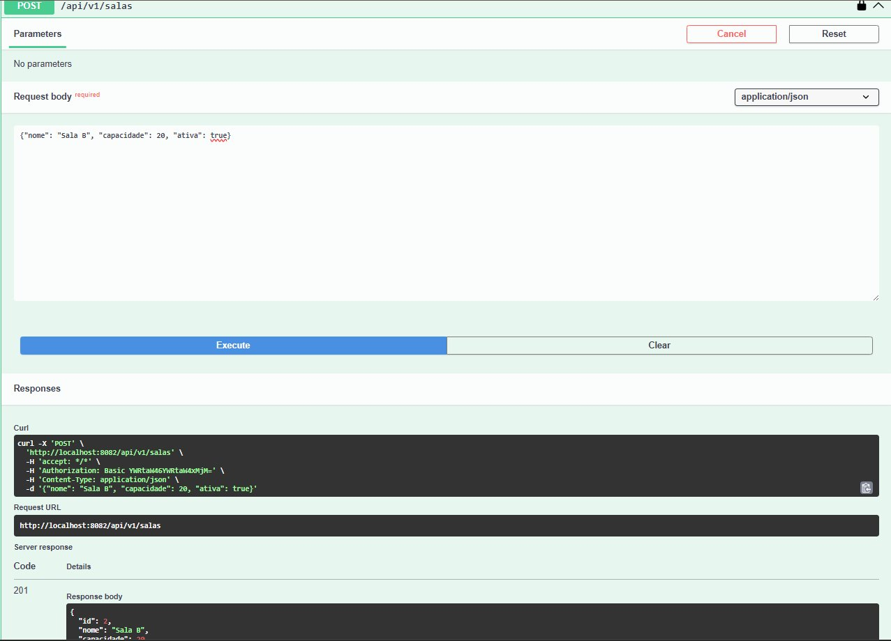

**USER tentando criar sala — 403 Forbidden:**

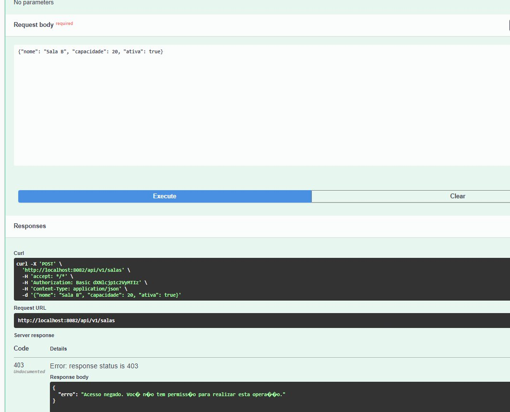

**Sem autenticação — 401 Unauthorized:**

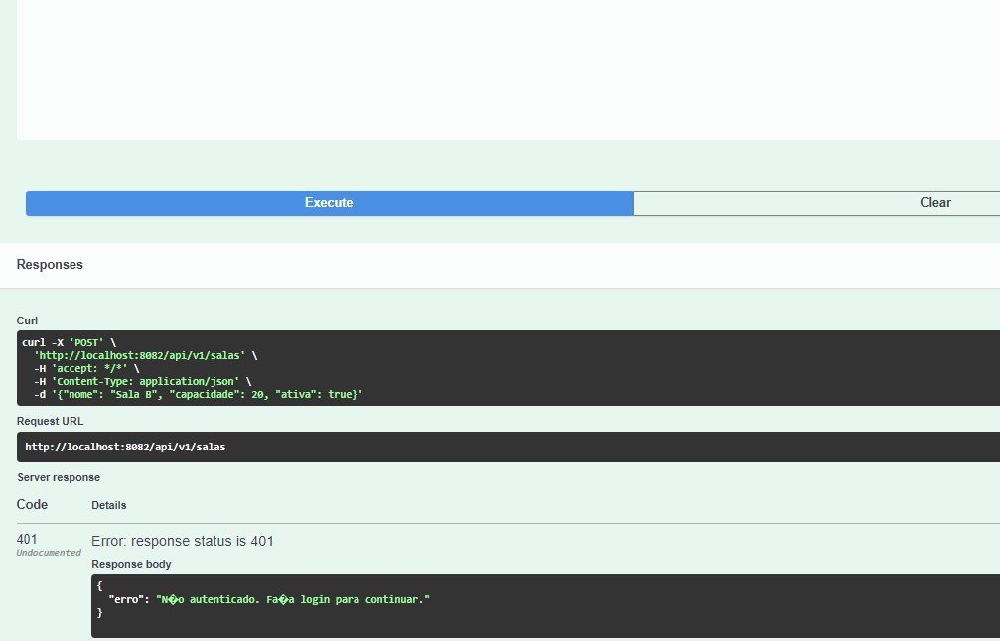

---

## Etapa 3 — 2FA com TOTP

Autenticação em dois fatores no `user-service`, compatível com Google Authenticator e Authy.

**Fluxo:**
1. `POST /api/v1/usuarios/{id}/2fa/setup` → gera segredo e retorna URI do QR Code
2. Usuário escaneia o QR Code com o app
3. `POST /api/v1/usuarios/{id}/2fa/ativar` → confirma com código do app, ativa o 2FA
4. `POST /api/v1/usuarios/{id}/2fa/verificar` → valida código OTP

**QR Code gerado:**

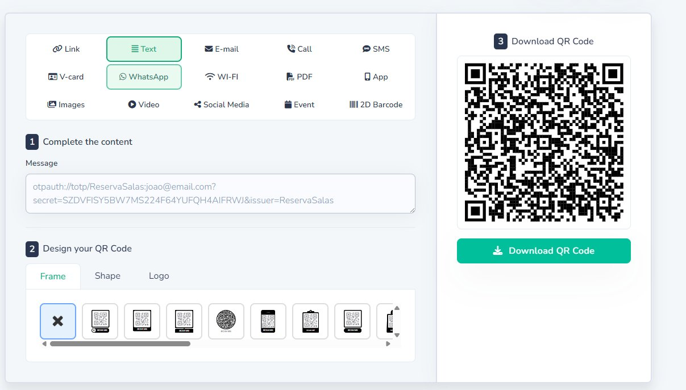

**Setup — 200 OK:**

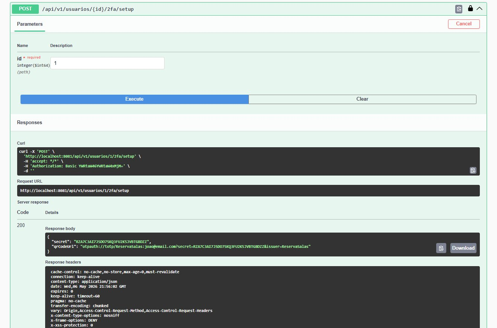

**Verificação — 200 OK:**

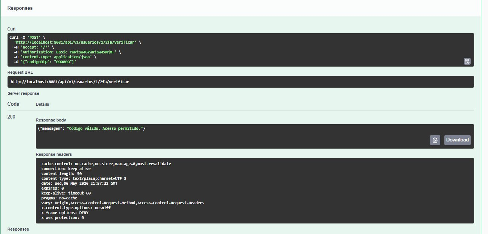

---

## Etapa 4 — Mensageria

Ao criar uma reserva, o `booking-service` publica um evento em dois brokers:

**RabbitMQ** → fila `reserva.criada.queue` → `NotificacaoConsumer` → simula e-mail de confirmação

**Kafka** → topic `reserva-registrada` → `AnaliticoConsumer` → simula registro em banco analítico

**Fila no painel do RabbitMQ:**

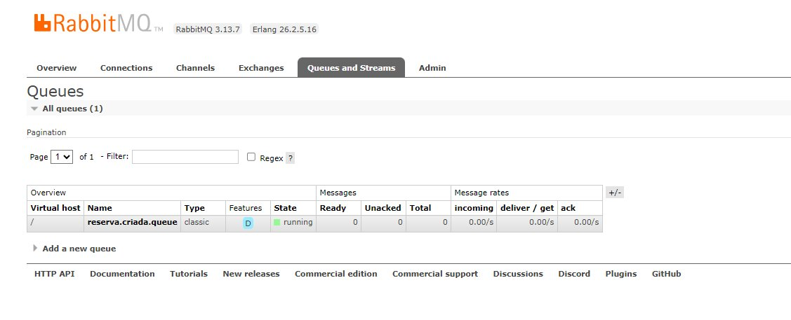

O evento só é publicado **após o commit da transação**. O `eventId` (UUID) garante **idempotência**.

---

## Etapa 5 — Testes de Integração

Testcontainers sobe containers reais durante os testes:

| Cenário | Status |
|---------|--------|
| Criar reserva como USER | `201 Created` |
| Criar sem autenticação | `401 Unauthorized` |
| Criar com conflito de horário | `422 Unprocessable Entity` |
| Cancelar reserva | `204 No Content` |
| Listar reservas (GET público) | `200 OK` |

---

## Etapa 6 — OpenAPI + GitHub Actions

**Swagger UI** disponível em cada serviço:

| Serviço | URL |
|---------|-----|
| user-service | http://localhost:8081/swagger-ui.html |
| room-service | http://localhost:8082/swagger-ui.html |
| booking-service | http://localhost:8083/swagger-ui.html |

**Swagger UI — User Service:**

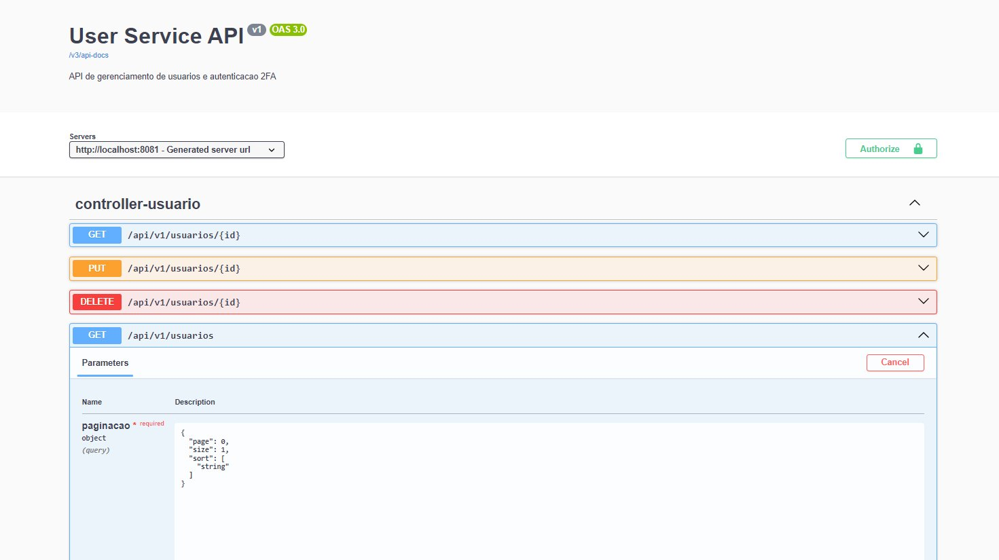

**Authorize com HTTP Basic:**

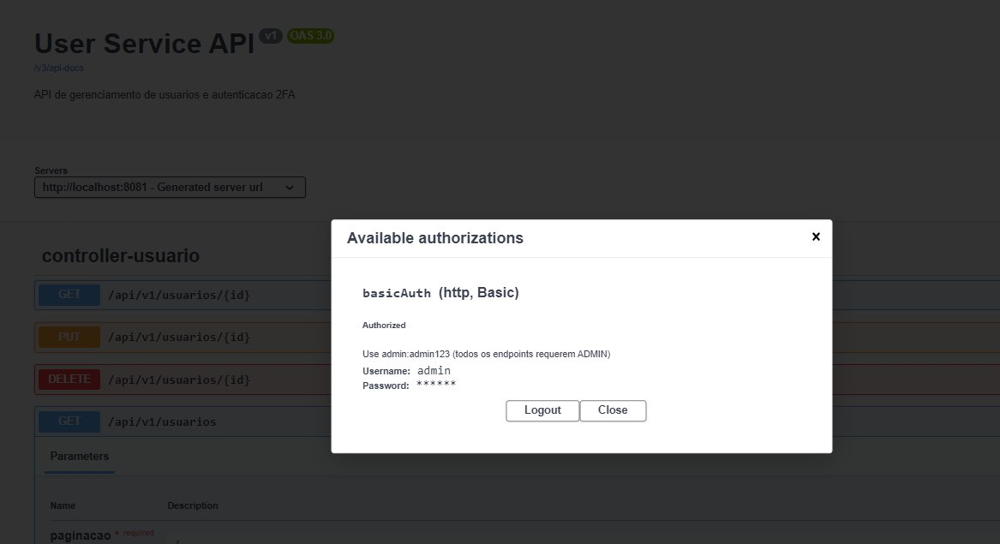

**Criando reserva — 201 Created:**

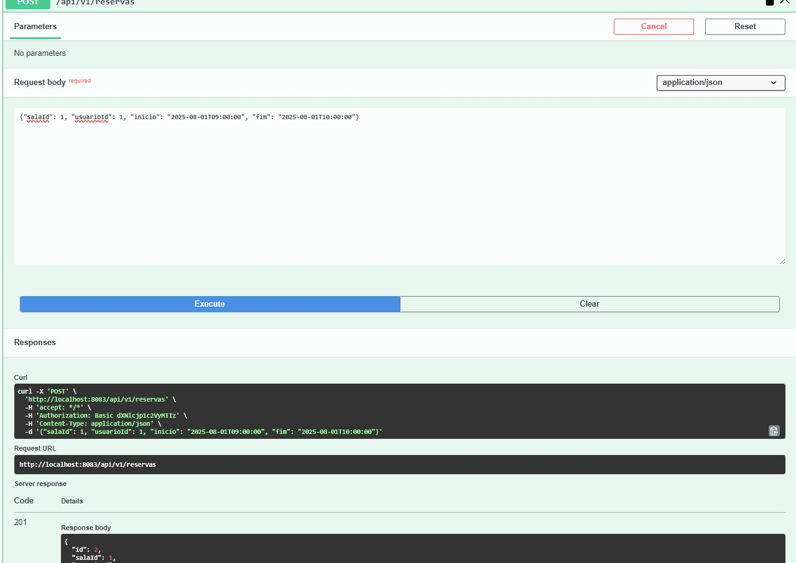

**Conflito de horário — 422:**

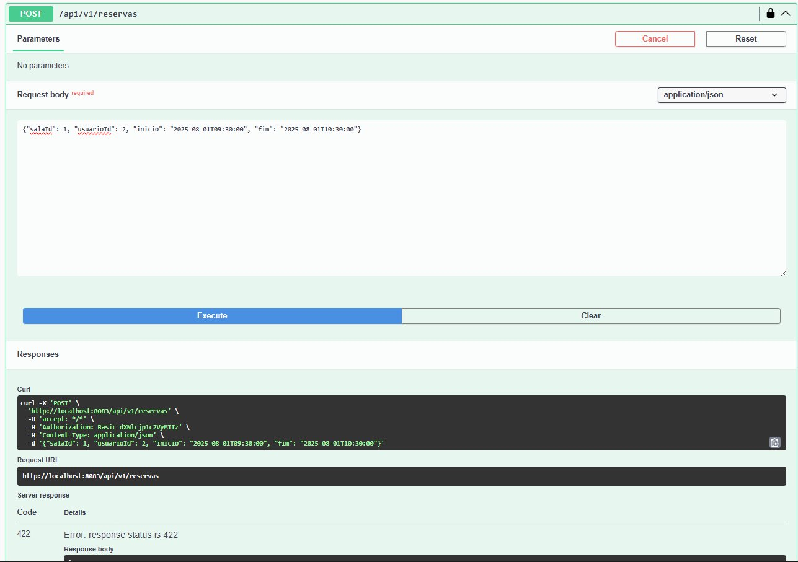

**Cancelando reserva — 204:**

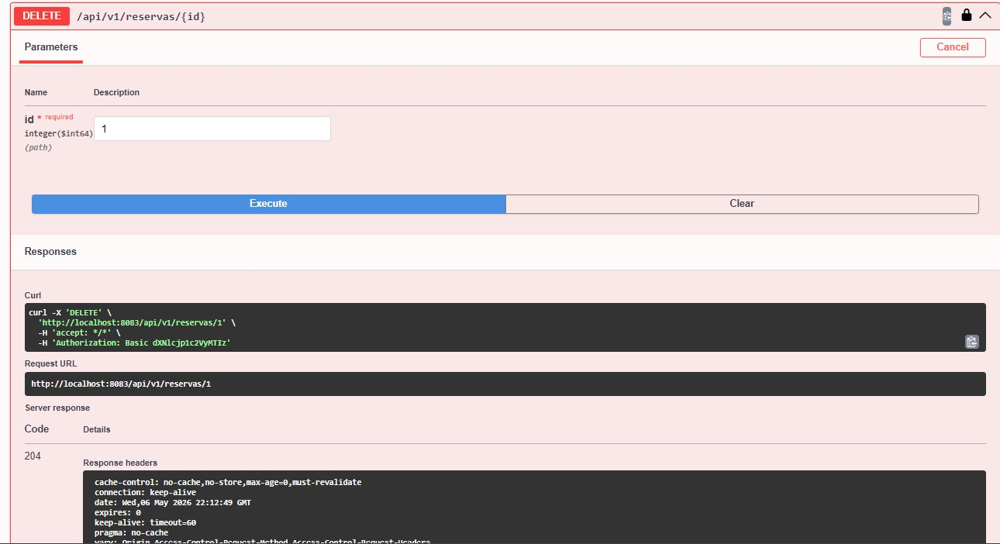

**Pipeline CI** (`.github/workflows/ci.yml`) — roda a cada push em `main` e `develop`:

```
Push → Build → Testes → Package → Upload JARs
```

---

## Endpoints (Fase 2)

### Salas — `room-service` (8082)

| Método | Rota | Auth | Status |
|--------|------|------|--------|
| `GET` | `/api/v1/salas` | Pública | `200` |
| `GET` | `/api/v1/salas/{id}` | Pública | `200` / `404` |
| `POST` | `/api/v1/salas` | ADMIN | `201` / `422` |
| `PUT` | `/api/v1/salas/{id}` | ADMIN | `200` / `422` |
| `DELETE` | `/api/v1/salas/{id}` | ADMIN | `204` / `404` |

### Usuários — `user-service` (8081)

| Método | Rota | Auth | Status |
|--------|------|------|--------|
| `GET` | `/api/v1/usuarios` | ADMIN | `200` |
| `GET` | `/api/v1/usuarios/{id}` | ADMIN | `200` / `404` |
| `POST` | `/api/v1/usuarios` | ADMIN | `201` / `422` |
| `PUT` | `/api/v1/usuarios/{id}` | ADMIN | `200` / `422` |
| `DELETE` | `/api/v1/usuarios/{id}` | ADMIN | `204` / `404` |
| `POST` | `/api/v1/usuarios/{id}/2fa/setup` | ADMIN | `200` |
| `POST` | `/api/v1/usuarios/{id}/2fa/ativar` | ADMIN | `200` / `422` |
| `POST` | `/api/v1/usuarios/{id}/2fa/verificar` | ADMIN | `200` / `401` |

### Reservas — `booking-service` (8083)

| Método | Rota | Auth | Status |
|--------|------|------|--------|
| `GET` | `/api/v1/reservas` | Pública | `200` |
| `GET` | `/api/v1/reservas/{id}` | Pública | `200` / `404` |
| `GET` | `/api/v1/reservas/sala/{salaId}` | Pública | `200` |
| `GET` | `/api/v1/reservas/intervalo` | Pública | `200` |
| `POST` | `/api/v1/reservas` | USER / ADMIN | `201` / `422` |
| `PUT` | `/api/v1/reservas/{id}` | USER / ADMIN | `200` / `422` |
| `DELETE` | `/api/v1/reservas/{id}` | USER / ADMIN | `204` / `404` |

---

## Como Executar

### Pré-requisitos

- Java 17+
- Maven 3.9+
- Docker e Docker Compose

### 1. Subir a infraestrutura

```bash
docker-compose up -d
```

### 2. Subir os microsserviços

```bash
# Terminal 1
cd user-service && mvn spring-boot:run

# Terminal 2
cd room-service && mvn spring-boot:run

# Terminal 3
cd booking-service && mvn spring-boot:run
```

> Suba na ordem: user → room → booking.

### 3. Testar

Via Swagger UI: http://localhost:8081/swagger-ui.html (ou 8082/8083)

Via curl:

```bash
# Criar usuário
curl -X POST http://localhost:8081/api/v1/usuarios \
  -u admin:admin123 \
  -H "Content-Type: application/json" \
  -d '{"nome":"Joao Silva","email":"joao@email.com"}'

# Criar sala
curl -X POST http://localhost:8082/api/v1/salas \
  -u admin:admin123 \
  -H "Content-Type: application/json" \
  -d '{"nome":"Sala A","capacidade":10,"ativa":true}'

# Criar reserva
curl -X POST http://localhost:8083/api/v1/reservas \
  -u user:user123 \
  -H "Content-Type: application/json" \
  -d '{"salaId":1,"usuarioId":1,"inicio":"2025-08-01T09:00:00","fim":"2025-08-01T10:00:00"}'
```

### 4. Rodar testes de integração

```bash
cd booking-service && mvn test
```

---

*Projeto desenvolvido como parte da formação prática na [Alura](https://www.alura.com.br).*
