# API de Gerenciamento de Reservas de Salas

> Projeto prático desenvolvido durante a formação na Alura — API REST para gerenciamento de reservas de salas de reunião, construída com Java e Spring Boot.

---

## Índice

- [Sobre o Projeto](#sobre-o-projeto)
- [Tecnologias](#tecnologias)
- [Requisitos Funcionais](#requisitos-funcionais)
- [Requisitos Não Funcionais](#requisitos-não-funcionais)
- [Regras de Negócio](#regras-de-negócio)
- [Validações](#validações)
- [Diagrama de Entidade-Relacionamento](#diagrama-de-entidade-relacionamento)
- [Diagrama de Fluxo](#diagrama-de-fluxo)
- [Estrutura do Projeto](#estrutura-do-projeto)
- [Endpoints](#endpoints)
- [Como Executar](#como-executar)

---

## Sobre o Projeto

Esta API permite o gerenciamento completo de salas de reunião e suas reservas. O sistema controla a disponibilidade das salas, evita conflitos de horário entre reservas e mantém histórico de cancelamentos. O projeto cobre orientação a objetos, arquitetura em camadas (Controller / Service / Repository), regras de negócio com validação de sobreposição de intervalos, persistência com Spring Data JPA e testes unitários.

---

## Tecnologias

- **Java 17+**
- **Spring Boot**
- **Spring Data JPA**
- **Spring Web (REST)**
- **Banco de dados relacional** (MySQL / H2 para testes)
- **Maven**

---

## Requisitos Funcionais

Requisitos funcionais descrevem **o que o sistema deve fazer** — as funcionalidades entregues ao usuário.

### RF-01 — Gerenciamento de Salas

| ID | Descrição |
|----|-----------|
| RF-01.1 | O sistema deve permitir o cadastro de salas com nome, capacidade e status (ativa/inativa). |
| RF-01.2 | O sistema deve permitir a listagem de todas as salas com paginação. |
| RF-01.3 | O sistema deve permitir a busca de uma sala específica pelo seu ID. |
| RF-01.4 | O sistema deve permitir a atualização dos dados de uma sala existente. |
| RF-01.5 | O sistema deve permitir a remoção de uma sala. |

### RF-02 — Gerenciamento de Usuários

| ID | Descrição |
|----|-----------|
| RF-02.1 | O sistema deve permitir o cadastro de usuários com nome e e-mail. |
| RF-02.2 | O sistema deve permitir a listagem de todos os usuários com paginação. |
| RF-02.3 | O sistema deve permitir a busca de um usuário específico pelo seu ID. |
| RF-02.4 | O sistema deve permitir a atualização dos dados de um usuário existente. |
| RF-02.5 | O sistema deve permitir a remoção de um usuário. |

### RF-03 — Gerenciamento de Reservas

| ID | Descrição |
|----|-----------|
| RF-03.1 | O sistema deve permitir a criação de uma reserva vinculando uma sala e um usuário a um intervalo de data/hora. |
| RF-03.2 | O sistema deve permitir a listagem de todas as reservas com paginação. |
| RF-03.3 | O sistema deve permitir a listagem de reservas de uma sala específica. |
| RF-03.4 | O sistema deve permitir a busca de reservas por intervalo de data/hora filtradas por sala. |
| RF-03.5 | O sistema deve permitir a busca de uma reserva específica pelo seu ID. |
| RF-03.6 | O sistema deve permitir a atualização do horário ou sala de uma reserva existente. |
| RF-03.7 | O sistema deve permitir o cancelamento de uma reserva (soft delete por status). |

---

## Requisitos Não Funcionais

Requisitos não funcionais descrevem **como o sistema deve se comportar** — qualidade, restrições técnicas e padrões.

| ID | Categoria | Descrição |
|----|-----------|-----------|
| RNF-01 | Arquitetura | O sistema deve seguir arquitetura em camadas: Controller, Service e Repository. |
| RNF-02 | Versionamento de API | Todas as rotas devem ser prefixadas com `/api/v1`. |
| RNF-03 | Respostas de Erro | Erros de validação devem retornar HTTP 400 com mensagem descritiva. Recursos não encontrados devem retornar HTTP 404. |
| RNF-04 | Paginação | Todos os endpoints de listagem devem suportar paginação via `Pageable`. |
| RNF-05 | Persistência | Os dados devem ser persistidos em banco de dados relacional via Spring Data JPA. |
| RNF-06 | Transações | Operações de escrita que envolvam múltiplas etapas (ex.: verificar conflito + salvar) devem ser atômicas via `@Transactional`. |
| RNF-07 | Testabilidade | A injeção de dependências deve ser feita via construtor para facilitar testes unitários. |
| RNF-08 | Transferência de dados | A API deve utilizar DTOs para trafegar dados, nunca expondo entidades JPA diretamente. |
| RNF-09 | Testes | O projeto deve conter testes unitários cobrindo as regras de negócio principais (conflito de horário, cancelamento, validações). |

---

## Regras de Negócio

Regras de negócio definem **restrições e políticas do domínio** que o sistema precisa respeitar.

| ID | Descrição |
|----|-----------|
| RN-01 | Não é permitido criar reservas para salas inativas. |
| RN-02 | Uma sala não pode ter duas reservas ativas com horários sobrepostos. |
| RN-03 | A verificação de sobreposição utiliza intervalo semiaberto: o início é inclusivo e o fim é exclusivo. Reservas onde `fim_A == inicio_B` **não** são consideradas conflito. |
| RN-04 | Reservas com status `CANCELADA` são ignoradas na verificação de conflito, liberando o horário para novas reservas. |
| RN-05 | O cancelamento de uma reserva não remove o registro do banco — apenas altera o status para `CANCELADA` (soft delete). |
| RN-06 | Ao atualizar uma reserva, a verificação de conflito exclui a própria reserva da comparação, evitando falso positivo. |
| RN-07 | O nome de uma sala deve ser único no sistema. |

---

## Validações

As validações abaixo foram testadas e documentadas durante o desenvolvimento:

### Salas

| Cenário | Entrada | Resposta esperada |
|---------|---------|-------------------|
| Criar sala com sucesso | Nome único, capacidade positiva, ativa true | `201 Created` |
| Criar sala com nome duplicado | Nome já cadastrado | `400 Bad Request` — *"Já existe uma sala cadastrada com o nome X"* |
| Criar sala com capacidade negativa | `"capacidade": -5` | `400 Bad Request` — *"A capacidade da sala não pode ser negativa"* |

**Criação com sucesso — 201 Created**

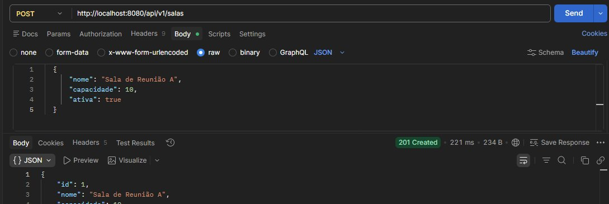

**Nome duplicado — 400 Bad Request**

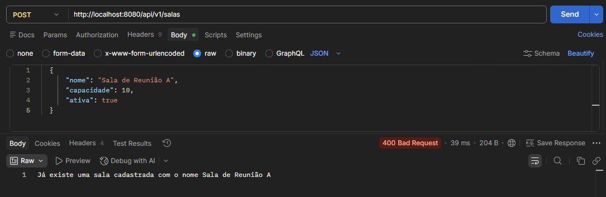

**Capacidade negativa — 400 Bad Request**

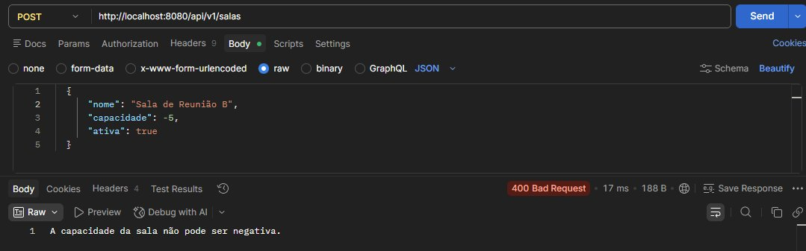

---

### Usuários

| Cenário | Entrada | Resposta esperada |
|---------|---------|-------------------|
| Criar usuário com sucesso | Nome e e-mail válidos | `201 Created` |
| Criar usuário com e-mail duplicado | E-mail já cadastrado | `500 Internal Server Error` *(constraint de banco — melhoria futura: tratar como 400)* |

**Criação com sucesso — 201 Created**

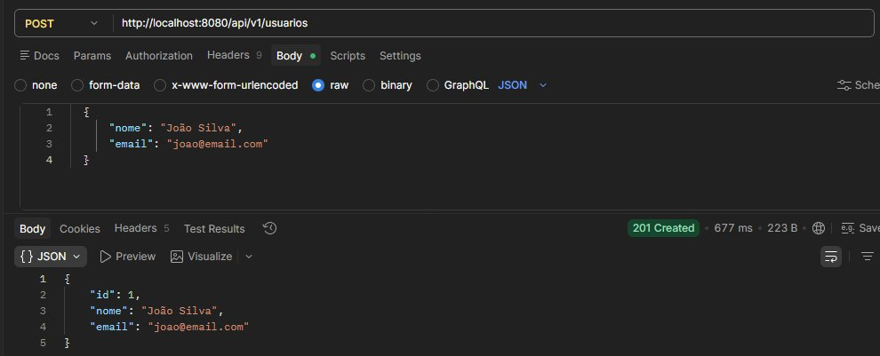

**E-mail duplicado — 500 Internal Server Error**

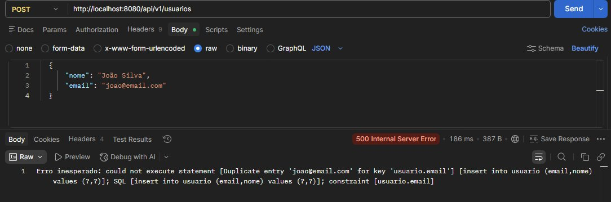

---

### Reservas

| Cenário | Entrada | Resposta esperada |
|---------|---------|-------------------|
| Criar reserva com sucesso | Sala ativa, usuário existente, intervalo válido sem conflito | `201 Created` |
| Criar reserva em horário já ocupado | Intervalo sobrepõe reserva ativa existente | `400 Bad Request` — *"Já existe uma reserva ativa para esta sala que entra em conflito com o horário solicitado"* |
| Cancelar reserva | `DELETE /api/v1/reservas/{id}` | `204 No Content` |
| Buscar reservas por intervalo | `GET /api/v1/reservas/intervalo?salaId=1&inicio=...&fim=...` | `200 OK` com lista paginada — retorna apenas reservas `ATIVA` dentro da janela |

**Criação com sucesso — 201 Created**

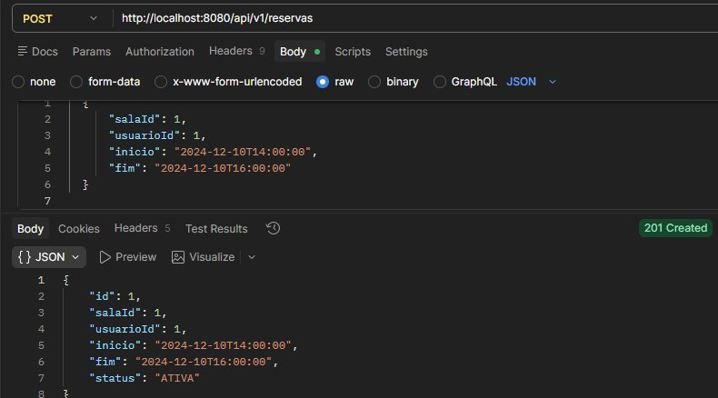


**Conflito de horário — 400 Bad Request**

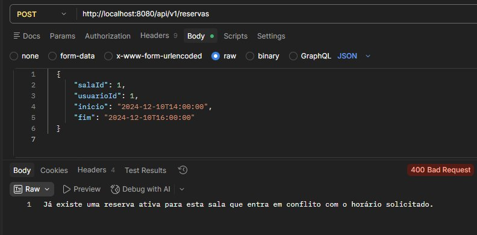

**Cancelamento — 204 No Content**

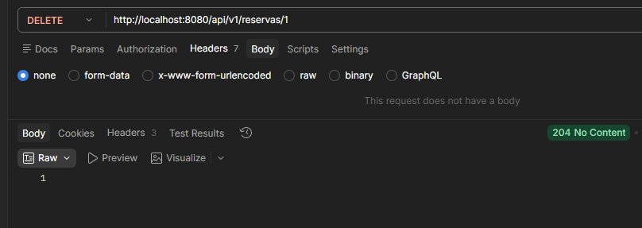

**GET todas as reservas — histórico com CANCELADA e ATIVA**

> Após o cancelamento, o horário fica livre para novas reservas. O GET retorna ambos os registros, confirmando o histórico preservado.

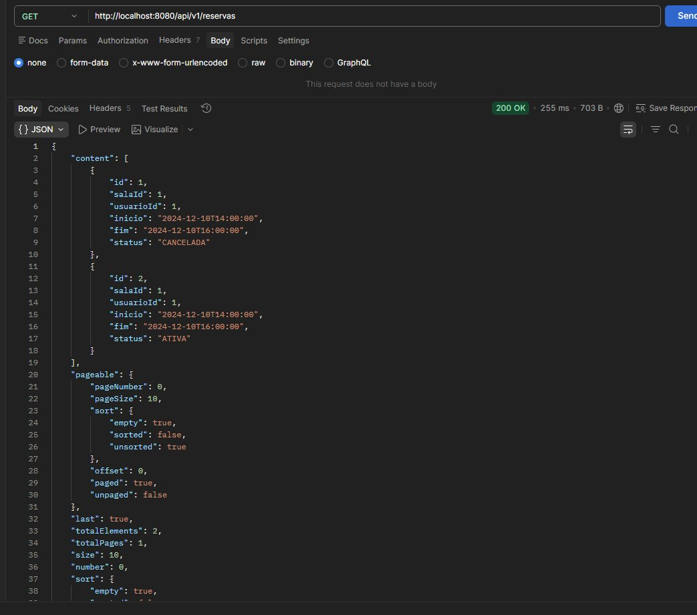

**GET por intervalo — filtra apenas ATIVA**

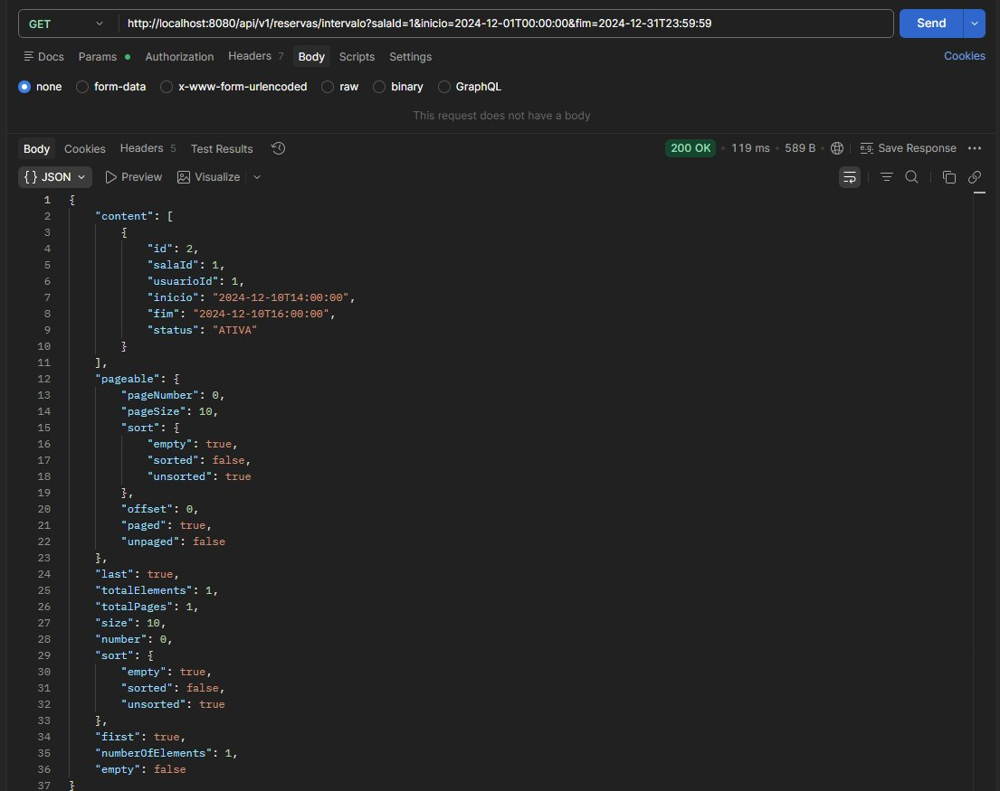

---

## Diagrama de Entidade-Relacionamento

O modelo de dados é composto por três entidades. `RESERVA` é a tabela central, referenciando `SALA` (N:1) e `USUARIO` (N:1) — uma sala pode ter várias reservas, e um usuário também pode ter várias reservas.

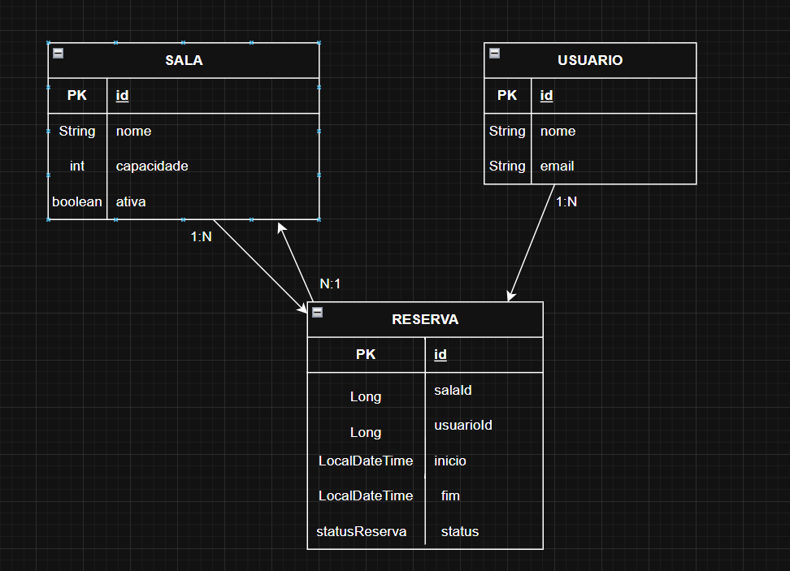

| Entidade | Campos principais |
|----------|-------------------|
| `SALA` | `id` (PK), `nome` (String, único), `capacidade` (int), `ativa` (boolean) |
| `USUARIO` | `id` (PK), `nome` (String), `email` (String, único) |
| `RESERVA` | `id` (PK), `salaId` (FK), `usuarioId` (FK), `inicio` (LocalDateTime), `fim` (LocalDateTime), `status` (StatusReserva) |

---

## Diagrama de Fluxo

O diagrama abaixo representa o fluxo macro da arquitetura (camadas Controller → Service → Repository → Banco) e o fluxo detalhado do endpoint mais crítico: **criação de reserva**, com todas as validações e pontos de falha.

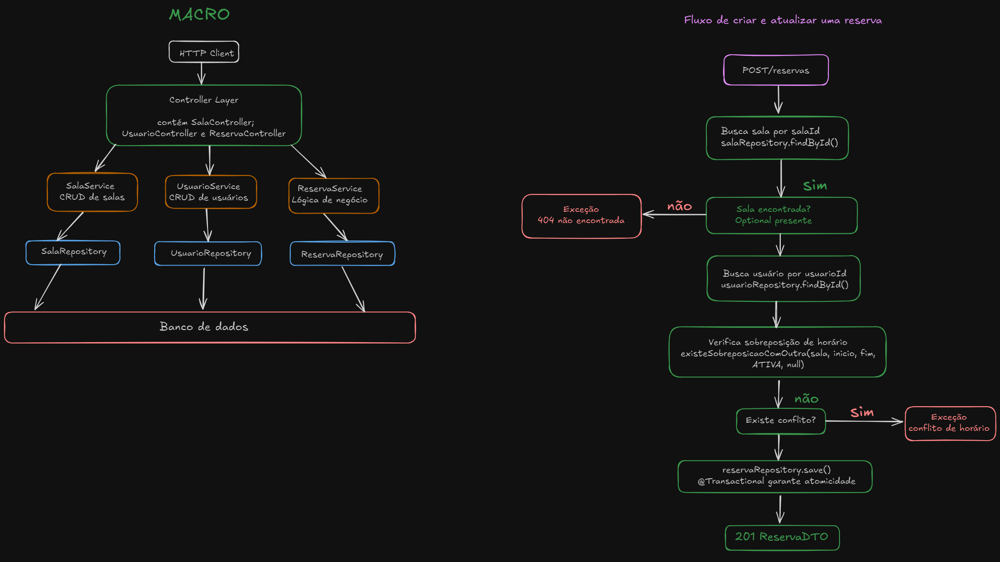

----

## Operações possíveis

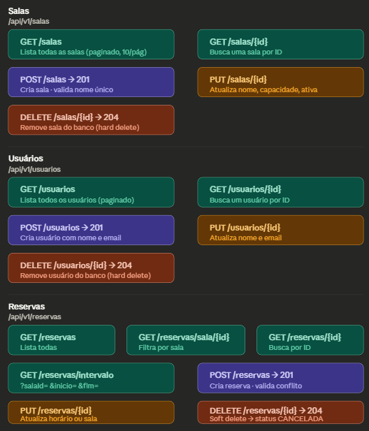

---

**Fluxo de criação de reserva — passo a passo:**

1. `POST /api/v1/reservas` recebe o DTO com `salaId`, `usuarioId`, `inicio` e `fim`
2. Busca a `Sala` pelo `salaId` → lança exceção 404 se não encontrada
3. Busca o `Usuario` pelo `usuarioId` → lança exceção 404 se não encontrado
4. Valida que `inicio < fim` → lança exceção 400 se inválido
5. Executa `existeSobreposicaoComOutra(sala, inicio, fim, ATIVA, null)` — verifica se existe outra reserva ativa na mesma sala com horário sobreposto
6. Se existir conflito → lança exceção 400
7. Salva a reserva no banco (`@Transactional` garante que os passos 5 e 7 sejam atômicos)
8. Retorna `201 Created` com o `ReservaDTO`

---

## Estrutura do Projeto

```
src/main/java/
├── controller/
│   ├── ControllerSala.java
│   ├── ControllerUsuario.java
│   └── ControllerReserva.java
├── service/
│   ├── SalaService.java
│   ├── UsuarioService.java
│   └── ReservaService.java
├── repository/
│   ├── SalaRepository.java
│   ├── UsuarioRepository.java
│   └── ReservaRepository.java
├── model/
│   ├── Sala.java
│   ├── Usuario.java
│   ├── Reserva.java
│   └── StatusReserva.java     ← enum: ATIVA | CANCELADA
├── dto/
│   ├── SalaDTO.java
│   ├── UsuarioDTO.java
│   └── ReservaDTO.java
└── exception/
    ├── ApiExceptionHandler.java
    └── RegraDeNegocioException.java
```

---

## Endpoints

### Salas — `/api/v1/salas`

| Método | Rota | Descrição | Status |
|--------|------|-----------|--------|
| `GET` | `/api/v1/salas` | Lista todas as salas (paginado) | `200` |
| `GET` | `/api/v1/salas/{id}` | Busca sala por ID | `200` / `404` |
| `POST` | `/api/v1/salas` | Cria uma nova sala | `201` / `400` |
| `PUT` | `/api/v1/salas/{id}` | Atualiza uma sala existente | `200` / `400` / `404` |
| `DELETE` | `/api/v1/salas/{id}` | Remove uma sala | `204` / `404` |

### Usuários — `/api/v1/usuarios`

| Método | Rota | Descrição | Status |
|--------|------|-----------|--------|
| `GET` | `/api/v1/usuarios` | Lista todos os usuários (paginado) | `200` |
| `GET` | `/api/v1/usuarios/{id}` | Busca usuário por ID | `200` / `404` |
| `POST` | `/api/v1/usuarios` | Cria um novo usuário | `201` / `400` |
| `PUT` | `/api/v1/usuarios/{id}` | Atualiza um usuário existente | `200` / `400` / `404` |
| `DELETE` | `/api/v1/usuarios/{id}` | Remove um usuário | `204` / `404` |

### Reservas — `/api/v1/reservas`

| Método | Rota | Descrição | Status |
|--------|------|-----------|--------|
| `GET` | `/api/v1/reservas` | Lista todas as reservas (paginado) | `200` |
| `GET` | `/api/v1/reservas/{id}` | Busca reserva por ID | `200` / `404` |
| `GET` | `/api/v1/reservas/sala/{salaId}` | Lista reservas de uma sala (paginado) | `200` |
| `GET` | `/api/v1/reservas/intervalo` | Busca reservas ativas por sala e intervalo | `200` |
| `POST` | `/api/v1/reservas` | Cria uma nova reserva | `201` / `400` / `404` |
| `PUT` | `/api/v1/reservas/{id}` | Atualiza uma reserva existente | `200` / `400` / `404` |
| `DELETE` | `/api/v1/reservas/{id}` | Cancela uma reserva (soft delete) | `204` / `404` |

**Parâmetros do endpoint de intervalo:**
```
GET /api/v1/reservas/intervalo?salaId=1&inicio=2024-12-01T00:00:00&fim=2024-12-31T23:59:59
```

---

*Projeto desenvolvido como parte da formação prática na [Alura](https://www.alura.com.br).*
